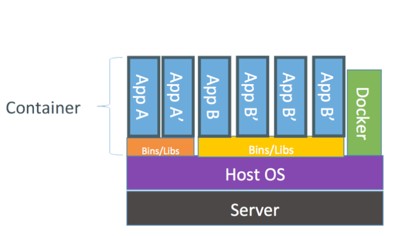

```{r setup, include=FALSE}
knitr::opts_chunk$set(eval = FALSE)
```

# Producto de datos: Ambiente

## ¿Por qué es importante?

- *Reproducibilidad*
- *Documentación*
- *Aislamiento*


## ¿Cómo lo puedo hacer?

| Característica             | Docker | AMI | ~python virtualenv~ | Ubuntu Juju |
|----------------------------+--------+-----+---------------------+-------------|
| Cross-platform             | ✓      | ✗   | ✗                   | ✓           |
| Portable                   | ✓      | ✗   | ✗                   | ✓           |
| ¿Se puede compartir?       | ✓      | ✓   | ✗                   | ✓           |
| ¿Se puede usar como lego?  | ✓      | ✓   | ✗                   | ✓           |
| ¿Soporte de la  comunidad? | ✓      | ✓   | ✗                   | ✓           |
| Multi-lenguaje             | ✓      | ✓   | ✗                   | ✓           |

# Docker Engine


Puedes pensar que *Docker* es como una laptop construida para un único propósito

## Docker Engine vs Virtual Machines


## Docker Engine vs Virtual Machines




## Docker Engine vs Virtual Machines

- Los contenedores de Docker son más rápidos que una VM, ya que no tienen tanto
  /overhead/ 

- Es como ejecutar un binario en lugar de ejecutar todo un SO

- Toda la especificación de una imagen de Docker, está especificada en un
  archivo de texto llamado =Dockerfile=, el cual puede estar junto a tu
  aplicación,

## Docker Engine: Componentes

- /Docker daemon/ 

- /Docker CLI/


# Checklist

- Si no lo instalaron:
  - https://docs.docker.com/engine/installation/

- Si ya lo instalaron, verifiquen:

```{bash}
docker --version
```

- ¿Funcionó?

- Algo para tener a mano:
  - https://github.com/wsargent/docker-cheat-sheet

# Conceptos importantes

- *Imagen*
  - Son como los planos de un proyecto =(+ ó -)=
  - Los planos de la laptop

- *Contenedor*
  - Es la cosa "construida" =(+ ó -)=
  - Es como la laptop que mencionábamos antes

# Comandos útiles

Revisar las imágenes

```{bash}
sudo su
docker images | head 
```

Revisar los contenedores

```{bash}
docker ps -a | head 
```

Descargar la imagen desde =dockerhub=

```{bash}
docker pull ubuntu
```


*NOTA* Cambiar =push= por =pull=, hace que suban la imagen a =dockerhub=

Crear un contenedor a partir de una imagen, ejecutarlo y al salir destruir el contenedor

```{bash}
docker run -it --rm ubuntu /bin/bash
```

*NOTA* Si la imagen no existe localmente, este comando descarga la imagen también.

Crear un contenedor a partir de una imagen, ejecutarlo y asignarle un nombre (no
destruye el contenedor al salir) 

```{bash}
docker run -it  --name test-ubuntu ubuntu /bin/bash
```

Ejecutar un contenedor ya existente

```{bash}
docker start -i test-ubuntu
```

Detener un contedor ya existente

```{bash}
docker stop  test-ubuntu
```

Ver los =logs= o los procesos (prendelo y abre otra terminal)

```{bash}
docker logs  test-ubuntu
docker top test-ubuntu
```

Y por último (importante para "/debuggear/"), conectarse a un contenedor "vivo"

```{bash}
docker exec -it test-ubuntu /bin/bash
```

*NOTA* El comando =attach= hace que tu terminal se convierta en la del
contenedor ejecutándose. Esto te permitirá ver lo que sucede, pero
ten cuidado de no presionar  =C-c= o detendrás el contenedor.

# Banderas

- =-i= Activa el modo =i= nteractivo.
  - También puedes usar =-a= pero este modo no es interactivo (es un /attach/).

- =-rm= borra el contenedor cuando se apaga

- =-v= /liga/ una carpeta de tu compu con una carpeta en el
  contenedor.

- =-p= /liga/ los puertos de tu compu con los puertos del contenedor.

# ¿Cómo hago mi propio contenedor?

- En un archivo ~Dockerfile~, en cual contiene todos los pasos de la
  instalación.

## DockerHub

-  Docker image registry with a nice-ish web front end
-  DockerHub:Docker :: GitHub:Git

## ¿Microservicios?

 Por construcción (y filosofía de diseño) las imágenes de ~docker~ sólo
ejecutan una cosa a la vez

- Es decir, se construyen como *microservicios* y estos son
  *inmutables*.

- Obviamente es posible darle la vuelta a esta restricción pero en esta clase no
  lo haremos. 

# ¿Y cómo hago un producto de datos?

- Lamentablemente son más complejos que un sólo contenedor, involucran
  varios contenedores

- =docker= permite /linkear/ varios contenedor
es (con la bandera
  ~link~), pero las líneas de comandos resultantes, se vuelven
  inmanejables (o por lo menos muy difíciles de /debuggear/).

