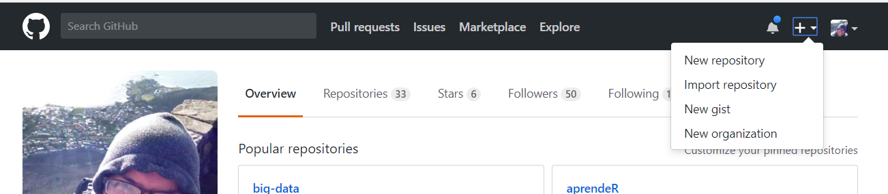

```{r setup, include=FALSE}
knitr::opts_chunk$set(warning = F, message = F, error = F)
```

Lo resume mejor Hilary Parker en su [blog](https://hilaryparker.com/2014/04/29/writing-an-r-package-from-scratch/) *Writing an R package from scratch* pero podemos resumirlo en:

> Me gustaría regresar el tiempo y hacer mi paquete desde el primer momento en que lo pensé,
> así usaría todo el tiempo que me hubiera ahorrado para ver videos de gatos en internet pues eso hubiera sido más productivo.

La realidad es que hacer un paquete en R es muy sencillo y ahorra mucha pérdida de tiempo, fomentando al mismo tiempo la colaboración con otros y reusar el trabajo de otros.

No nos meteremos en el detalle de qué es un paquete y por qué hacer ciertas cosas, para ello pueden usar de referencia el libro [*R packages*](http://r-pkgs.had.co.nz/) de Hadley Wickham, en donde entra en todos los detalles.

Nos enfocaremos en hacer un paquete de jueguete para que puedan ustedes comenzar el propio.

Tutorial basado en el blog de [Jenny Brian](http://stat545.com/packages06_foofactors-package.html) (*creative commons*)

## ¿Por qué hacer un paquete?

Los paquetes son útiles para proveer funciones y datos para su uso.

Funcionan mejor que `source()`ar las funciones o leer los datos de archivo porque:

- Tienen una estructura estándar
- Tienen páginas de ayuda y viñetas
- Pueden incorporar código que no es de R (de C++, por ejemplo)
- incluyen pruebas para asegurarse que las cosas siguen funcionando como debieran
- hay funciones que te ayudan a checar el paquete completo

Los scripts seguirán siendo nuestro pan de cada día para ejecutar pasos en un análisis de datos específico.

Los paquetes de R vienen en general de:

- CRAN
- github
- bioconductor

Vamos a revisar un par de paquetes en github, para ver cómo se estructura el código:

- dplyr
- magrittr

... o seleccionen el paquete que les guste de CRAN y metanse a ver el código en github de CRAN.

## Paquetes de otras oficinas de estadística

Se ha compilado la siguiente lista (pueden contribuir a ella) de [paquetes útiles en estadística oficial](https://github.com/SNStatComp/awesome-official-statistics-software).

# Instalaciones necesarias

Deben de seguir las instrucciones [de este blog](http://stat545.com/packages01_system-prep.html).

Realmente se obtiene casi todo lo necesario del paquete devtools pero hagan las configuraciones para su sistema operativo.

# Crear el paquete

```{r}
library(devtools)
```

Para evitar estar cargando el paquete pueden agregar lo siguiente a su .Rprofile o al de su paquete:

```{r, eval = F}
if (interactive()) {
  suppressMessages(require(devtools))
}
```


Ahora si, creamos un paquete

```{r, eval=FALSE}
devtools::create("~/tmp/mipaquete")
```

Deben ver algo asi


## Que se creo en forma automatica

- `.gitignore` pues se anticipa por defautl el uso de git que incluye siempre un archivo gitignore *oculto* que te permite configurar -para ese repositorio exclusivamente- los archivos que no deben nunca ser leidos por git (e.g. los datos).
- `.Rbuildignore` enlista los archivos que se necesita tener pero que no seran incluidos cuando se construya el paquete de R desde esta fuente.
- `DESCRIPTION` proveé metadatos acerca de tu paquete. 
- `mipaquete.Rproj` es el archivo que convierte a todo ese directorio en un projecto de Rstudio. Incluso si no se utiliza Rstudio, el archivo no te hace daño (se puede suprimir la creación del mismo en el create con el parametro rstudio en falso)
- `NAMESPACE` declara las funciones que tu paquete exporta para uso externo y la funciones externas que tu paquete importa desde otros paquetes. En este momento, tiene contenido temporal (aunque funcional) que es más ilustrativo.
- `R/` es el directorio donde todo ocurre. Ahí van todos los archivos .R que contienen las definiciones de las funciones que conformarán tus paquetes.

Puedes cerrar Rstudio y hacer doble click en `mipaquete.Rproj` o ir a Archivo - Abrir proyecto y buscar el archivo. (*Hazlo ahora*).

# Agregamos control de versiones

La gente de Rstudio, en particular los que desarrollaron devtools, son fan de github. Es más fácil todo si usas git.

```{r, eval = F}
devtools::use_git()
```

Lo único que se creó es un directorio .git en el home del proyecto.

# Agregamos la primera función

Agrega un archivo .R en el directorio R/ que se llama fbind.R

Dentro del script, incluye:

```{r, eval = F}
fbind <- function(a, b) {
  factor(c(as.character(a), as.character(b)))
}
```

## Prueba tu función

Para cargar la función, usa (si no tenías instalado roxygen2 te pedirá que lo hagas, dile que si)

```{r, eval = F}
devtools::load_all()
```

Ahora, si, puedes llamarla en la consola

```{r, eval = F}
fbind("adios", "hola")
```

Nota que no se cargó en el ambiente global de R

```{r}
exists("fbind", where = ".GlobalEnv", inherits = FALSE)
```

load_all te permite usar interactivamente lo que acabas de crear como si hubieras instalado tu librería y la hubieras cargado.

## Revisa que todo funciona

Corre

```{r, eval = F}
check(document = FALSE)
```

Revisa el output! No dejes que los problemas se salgan de control

Ahorita lanza dos advertencias:

- No hay license
- Hay funciones no documentadas

Te deja seguir pero eso no está bien en un paquete.

Ahora podemos instalar el paquete:

```{r, eval = F}
devtools::install()
```

Checa que funcionó:

```{r, eval = F}
library(mipaquete)
grep("mipaquete", installed.packages()[ , "Package"], value = TRUE)
```

## Agrega a git!

```
git add R/fbind.R
git commit -m "agrego funcion fbind, concatena dos factores"
```

# Editamos el archivo DESCRIPTION

Metete a el y editalo, ponte a ti como autor, agrega un titulo y una descripción. Especifica una licencia (por ahora MIT). Al final debe verse como esto:


## Agrega a git!

```
git add -u .
git commit -m "agrego descripcion para el paquete"
```

# Agregamos licencia

Es un paso MUY importante, por ahora usamos alguna de default.

```{r, eval = F}
use_mit_license()
```

Ahora si, se agregó un archivo de licencia. Abre el archivo y revisa la fecha y tu nombre como propietario de la licencia.


En el futuro, [escoge una licencia con cuidado](https://choosealicense.com/) y verifica con la CGI que pasos debes seguir para que no te metas en problemas innecesarios.

## Agrega a git!

```
git add LICENSE
git commit -m "Agrego licencia al paquete"
```

# Documenta tu función

Un paquete sin documentación no es útil (ni para tu yo futuro ni para nadie más). Hay que explicar qué hace la función, qué parametros tiene, cómo se usa y dar ejemplos.

Para ello, se usa el paquete roxygen2. Para tener documentada la función que se hizo, es necesario tener un archivo man/fbind.Rd

Si usas roxygen2 (lo mas recomendable) ese archivo nunca lo editas a mano. Lo que se hace es agregar comentarios en un formato específico encima de la función fbind, en el archivo fbind.R. 

Hagámoslo

```{r, eval = F}
#' Concatena dos factores
#'
#' Crea un nuevo factor a partir de dos factores existentes, donde el nuevo factor tiene nuevos niveles
#' determinados por la unión de los niveles de los factres de entrada.
#'
#' @param a factor
#' @param b factor
#'
#' @return factor
#' @export
#' @examples
#' fbind(iris$Species[c(1, 51, 101)], PlantGrowth$group[c(1, 11, 21)])
```

Se debe ver así:


Ahora, debo correr algo para que se genere (automaticamente) el archivo correspondiente de documentacion (man/fbind.Rd)

```{r, eval = F}
document()
```

Uso la ayuda para ver el trabajo

```{r, eval = F}
?fbind
```

Abre el archivo NAMESPACE y ve que se agregó una línea en forma automática (¡no edites este archivo a mano!)

Vuelve a checar y al revisar el output verás que no hay advertencias:

```{r, eval = F}
check()
```

## Agrega a git!

```
git add -u .
git add man/fbind.Rd
git commit -m "documento mi funcion fbind"
```

# Agrega pruebas

Las pruebas unitarias son fundamentales. Lo que vas haciendo -ojalá- se vuelva más y más complejo y es muy importante establecer pruebas **desde el principio** de forma que puedas estar segurx que lo nuevo que vas haciendo no rompe lo que había echo antes y, además, que el funcionamiento de lo que  ya construiste es el esperado.

Acostumbrarse a pensar en las pruebas adecuadas para sus funciones/desarrollos es complicado al principio pero es una muy buena práctica (más si lo que se desea es contribuir en serio).

Preparamos a nuestro paquete a que haremos pruebas:

```{r, eval = F}
devtools::use_testthat()
```

Te cambió la descripcion del paquete, y te agrega la carpeta tests

Crea un nuevo script tests/testthat/test_fbind.R y pon:

```{r, eval = F}
context("Binding factors")

test_that("fbind binds factor (or character)", {
  x <- c('a', 'b')
  x_fact <- factor(x)
  y <- c('c', 'd')
  z <- factor(c('a', 'b', 'c', 'd'))

  expect_identical(fbind(x, y), z)
  expect_identical(fbind(x_fact, y), z)
})
```

Esto prueba que el comportamiento de fbind es exactamente el deseado: 

- su resultado es la concatenación de dos factores
- su resultado es la concatenación de un factor y un character

Ahora, carga library(testthat) o alternativamente ejecuta load_all()

Posteriormente, ejecuta las pruebas:

```{r, eval = F}
test()
```

Todo debe salir bien. 

Hay un capítulo dedicado a pruebas en el libro de Hadley ([R packages](http://r-pkgs.had.co.nz/tests.html))

## Agrega a git!

```
git add -u .
git add tests/testthat/test_fbind.R tests/testthat.R
git commit -m "agrego pruebas para mi funcion fbind"
```

# Usando funciones de otros paquetes

Al final, querrás usar funciones de otros paquetes en tu paquete (cosas que están fuera del R-base).

Antes, tuvimos que exportar la función fbind, ahora lo que queremos es importar funciones del namespace de otros paquetes. 

Agregamos el paquete dplyr, para poderlo usar en nuestras funciones:

```{r, eval = F}
use_package("dplyr")
```

Esto agrega una linea en DESCRIPTION, en la sección de importaciones, donde se declara dplyr. 

## Agrega a git!

```
git add -u .
git commit -m "agrego dplyr para importacion de sus funciones"
```

# Otra función

Para probar el uso de una función externa, agregamos una nueva función en un archivo R/freq_out.R
  
```{r, eval = F}
#' Make a frequency table for a factor
#'
#' @param x factor
#'
#' @return tbl_df
#' @export
#' @examples
#' freq_out(iris$Species)
freq_out <- function(x) {
  xdf <- dplyr::data_frame(x)
  dplyr::count(xdf, x)
}
```

Nota como, para llamar a una función de dplyr debo de llamarla usando su namespace (es como llamar a alguien por nombre y apellido). apellido::nombre o namespace::nombre

Agrega la función

```{r, eval = F}
load_all()
```

Usala

```{r, eval = F}
freq_out(iris$Species)
```

Documentala

```{r, eval = F}
document()
```

Instala

```{r, eval = F}
check()
install()
```

## Agrega a git!

```
git add R/freq_out.R man/freq_out.Rd
git commit -m "agrego funcion freq_out, cuenta frecuencias de niveles en un factor"
```

# Agrego documentación general

El archivo DESCRIPTION es muy restrictivo pues los estándares para escribir paquetes son estrictos.

Sin embargo, se puede agregar una documentación más detallada usando 

```{r, eval = F}
use_package_doc()
```

Se creó el archivo `R/mipaquete-package.r` Vamos a documentar un NULL (es decir, una función que no tiene nada) el punto es que se genere un .Rd automaticamente (cuando hacemos document())

Pongan cosas en el archivo y corran:

```{r, eval = F}
document()
```

Checo:

```{r, eval = F}
?mipaquete
```


## Agrega a git!

```
git add R/mipaquete-package.r man/mipaquete-package.Rd
git commit -m "agrego docuemntacion adicional al paquete"
```

# Las viñetas

Los paquetes tienen (los buenos) viñetas que te dan tutoriales para usar las funciones.

Agregamos una boba para ilustrar

```{r, eval = F}
use_vignette("hola-mipaquete")
```

¿Qué paso?

- Se agregó knitr y rmarkdown a los paquetes sugeridos en el archivo DESCRIPTION
- Se creó un archivo con contenidos sugeridos para una viñeta, llamado vignettes/hola-mipaquete.Rmd
- Se agregó inst/doc al .gitignore (para no sobrecargar al paquete)
- Si usas Rstudio, se abrió el archivo para que lo modifiques

Cambia lo minimo indispensable

- Cambia el título en el YAML
- Ponte como autor o remueve esa línea
- Quita el contenido del template y pon como usas las funciones.

## Agrega a git!

```
git add -u .
git add vignettes/hola-mipaquete.Rmd
git commit -m "agrego una viñeta básica"
```

# Agregalo a tu GitHub

Hasta ahora, llevamos control de versiones con git usandolo en local. Sin embargo, estamos aquí para trabajar colaborativamente.

Checa que no haya nada que agregara en el directorio del paquete (git status)



```
git status # que diga nothing to commit
git remote add origin https://github.com/TUUSUARIO/mipaquete.git
git push -u origin master
```

# Agrega un readme

Un readme contiene lo básico que alguien tiene que saber para saber qué tiene ese repositorio.

Agrega uno usando 

```{r, eval = F}
devtools::use_readme_rmd()
```

Te dará secciones automáticas para que:

- Describas el propósito del paquete
- Digas cómo instalarlo
- Enseñes un poco de su uso

Copia el mínimo de los docs que ya creaste!

Checa:

```{r, eval = F}
install()
rmarkdown::render("README.Rmd")
```

## Agrega a git!

```
git add -u .
git add README.Rmd
git commit -m "agrego README"
git push
```

# Packrat

Agrega packrat y ahora tendrás ambiente controlado!


